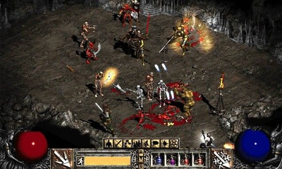

# Design Pillars: Inspiration Isn't Enough, Part 1


If you're reading this blog, this is the development blog for the computer RPG that I'm developing. The project is currently named 'Lucifer RPG' until I'm basically ready to release it into the world. I started the project in January 2020 after I was doing a solo-run of a hacked D&D game using a Diablo 2 supplement.

I enjoyed the lethality and simplicity of the thrown-together game, but hated simulating the rolls for monsters and loot. And oh boy, was there A LOT of rolling. So I thought to myself, "hey, I can code, why not make this into a little RPG combat sim???' I made the first build in 1-1/2 weeks and attempted to make it similar to KOTOR or NWN combat, which simulated turns in real-time. It was... boring. That's when I realized that the combat needed to be more interesting and I kept playing with the design. Things spun a bit out of control. It became a lot of different things after 6 months of development and I ran myself into the ground trying to figure out what this game is. I had to do something different, because my process kept leading me to dead ends.

If there's anything I learned through 6 agonizing months of work on the project, it's that a game's design can be directionless and frustrating to work on if you don't have structure or vision. I was struck with the inspiration to make something, but I lost direction after I made it and realized inspiration isn't enough. Especially if you're spending several months on a project, inspiration will only get you through a couple of builds before you learn that your ideas suck. Iterating on a game's design is necessary, whether it be tabletop or electronic, but if you don't know what you're making, you're just spinning your wheels.

## Setting Design Pillars


So, *design pillars*. You might have heard designers talk about design pillars. They're a useful, abstract device that designers use to build a game on and deliver on the experience that they want to give players. In any sort of product design, you might also hear *'promise pillars'* thrown around. In promise-based marketing, a product/brand/company will be advertised to deliver on a promise. This is the experience that the thing in question is committed to providing. When the experience isn't delivered, that promise isn't met. Games are all about delivering promises. In Skyrim, the promise is to make you feel like you're a fantasy hero in a seamless world. In Dance Dance Revolution, the promise is to feel like you're an awesome dancer. This experience is communicated through a game's mechanics.

This is where inspiration is actually the most important part of the process. You decide on a promise because you're inspired to create a specific experience. From there, you can decide on the design pillars that give your project structure. The question you need to ask yourself when figuring out design pillars is: how do I create this experience through the game's design? You might also have design pillars related to technical specifications or interface constraints, such as mobile-only or making a game for controllers. A good design pillar is simple, specific, and sets a clear direction. If you can't decide what features you would implement based on a design pillar, you might want to reconsider your design pillar.

Here's a negative example: *story* as a design pillar. There are a lot of ways to deliver on story and everyone has ideas on what makes an engaging story. It's too abstract and vague. How do we improve this? You could have *interactive story*, like many Bioware and Infinity Engine games. Maybe a *cinematic story*, like most AAA action and adventure games. You could even mix them together! Uncharted is a great example of a game series that depicts action sequences that are both interactive and cinematic to tell the story.

## Revisiting Lucifer


My original inspiration was the experience of fighting in tactical combats against hordes of demons. I had to constantly change my tactics depending on what I was fighting. My resources were limited and I had to manage them carefully. Every now and again I would get a windfall of power after finding loot that gave me a huge power-spike or scoring a critical hit while I'm near death. I was close to dying a lot. I *did* die a couple of times. I had to decide between each fight whether I wanted to keep going. Each level after the first promised better loot, but greater challenges. At the core of the Lucifer RPG is surviving fatal challenges through wits, resourcefulness, and luck. With this inspiration in mind, I can create pillars that deliver on that promise.

In Part 2, I will talk about the design pillars for Lucifer RPG and how I decided on them.

---
### Bade Habib

```Physical embodiment of a nap. Consumes coffee like it's going out of style. Spends way too long on building D&D characters.```

**Twitter:** @DefiantJung

**Github:** https://github.com/JungDefiant
