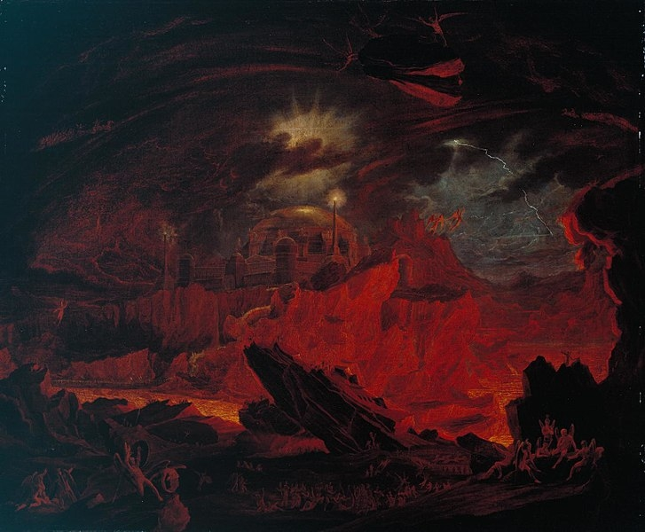
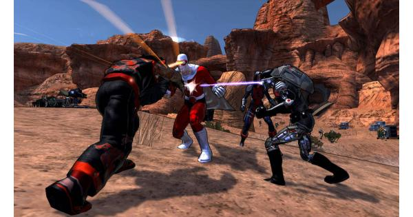

## Design Pillars: From Inspiration To Structure, Part 2


In the last entry of this blog, I talked about how I took inspiration from my playthrough of a hacked D&D game to make a game about Lucifer fighting his way out of Hell. I had to find what I enjoyed about the experience to understand the promise of this project: lethal 'high risk, high reward' combat, lucky breaks in the midst of imminent peril, and exciting loot finds. I also wanted to add design elements that I enjoy in other RPG's. I love spending hours finding synergies when building D&D characters. There are so many options to navigate and several nuances in the system to explore. After putting all these elements together, plus some random inspirations from 'things I like', I came up with these 8 design pillars.

### Pillar 1: Turn-Based Combat Incentivizing Risk-Reward
The combat will be turn-based and incentivize risk-reward. Less risky options will be generally less effective and later challenges will require you to take more risks. This means players should weigh 'playing it safe' with 'throwing a hail mary'. The turn-based structure will give the player time to plan their turn and weigh their decisions carefully. Due to this emphasis on risk-reward, risk-mitigation will be minimized in the design. Many defenses, such as healing or damage reduction or dodging, often soften the blow of taking risks, so these will be heavily limited. Mitigation effects will either be limited in use, minimal value, or come at a cost.

### Pillar 2: Deterministic Luck
All luck in the game will be deterministic, meaning all results in a random range of values are guaranteed. For example, a die is rolled six times. In a non-deterministic system, the die might roll three 1's, 4, 2, then 5. With deterministic luck, the die will roll one of each side, but the order is randomized. This 'deterministic luck' system is used for everything from loot to critical hits to damage ranges. The benefit of this system is that it reduces the punishment of randomness and allows players to make strategic decisions regarding luck-based mechanics. If a player is getting several bad loot rolls in a row, they have the assurance that they will eventually roll something valuable after enough rolls. RNG purists might not like the system for taking a lot of the unpredictability out of random mechanics. I'm fine with losing out on the total chaos of full randomness if it means including unpredictability that incentivizes strategy.

### Pillar 3: Synergy Between Character Options
Choices in build options and actions taken in combat should encourage synergy. Character options such as loot, abilities, and classes should be modular to encourage a diversity of builds. Chaining together the right actions in combat should be rewarding, especially if it feels like you broke the game with your clever play. Often the concern with a system like this is whether balance can be maintained, but 'balance' is a subjective term. In the context of this game, balance refers to making every option feel useful in specific contexts. Each option should also have a trade-off, whether it be investment of skill points or the option itself having drawbacks.

### Pillar 4: Builds Defined By Player Choice, Not Loot
In games like Diablo 3 and many MMO's, loot is often the defining trait of your character. Players are encouraged to build their character according to random loot drops. While this type of gameplay is valuable and fun in its own way, that focus on loot won't be the case with this game. As a rule of thumb, loot will only contribute up to 1/4 of a build's overall power. Each piece of loot should augment the way you play in an interesting way without being the star of the show. Loot can also serve as inspiration for new builds.

### Pillar 5: Every Effect Is Dynamic and Based In Narrative
I'd like to start with a critique of an existing mechanic, before digging into the details of this pillar. I understand the benefits of '+X stat bonuses' in RPG's. They make math easy, players can quickly make decisions about the right choice, and they're simple to design. However, they have some fatal flaws. 

1) They offer no choice. If I'm deciding between a bonus in Strength to a bonus in Dexterity for my big, beefy warrior, I pick the Strength bonus. If I have two items offering a Strength bonus and one of them offers a higher bonus, I pick the item with the higher bonus. Diverse loot can mitigate some of the issues of bonuses, since the decision is weighed against other benefits of the item. However, in a game that emphasizes less on loot, this isn't a viable option. 

2) They aren't based in narrative. What does +10 Strength mean? +43 Strength? +185305 Strength? Eventually the numbers lose their meaning and sense of scale. Often, they don't make sense in terms of story either. Why does a robe deal damage back to incoming attackers? Why does a suit of armor make me better at getting more gold? These exist in games because mechanics are prioritized over its meaning in the game world. Often, 'well it's magic' is used as an easy excuse to make number-crunching mechanics. A particularly striking example of this narrative dissonance is in Champion Online's statistics system. So you can throw cars in the game if your Strength is high enough. But there is a problem with this system. See, everyone's stats scaled over time, regardless if you put points into them, and the devs didn't want to gate people from throwing cars too early. The side-effect is that you had skinny mad-scientist characters with the lowest Strength possible able to throw semi's the same as the hulking bruiser characters. MMORPG number-scaling tied to character facts created narrative dissonance. Any illusion about the identity of your character becomes broken because of the game's stat system prioritizing mechanics over narrative.



In Lucifer RPG, narrative will come first and serve as an inspiration for the mechanics. Power will not scale based on a single number growing higher and higher, but rather the combination of different effects that add together. Effects will only give benefits in specific circumstances, as opposed to flat general bonuses, to make them more dynamic.

### Pillar 6: Clear Communication of Math and Effects
You may have played RPG's where numbers reach hundreds or thousands or millions. Even RPG's that don't reach this amount can have complicated calculators weighed down by a dizzying number of ability options, passives, and persistent effects. Often, the point of this is to look impressive or it's simply the result of a nuanced system. However, it can make doing on-the-fly math complicated or impossible. One of this game's goals is to present the 'under-the-hood' information in a way that is comprehensible and trimmed-down. Players should immediately understand the full impact (and consequences) of their choices through the information presented. If information is missing, it should be done for tactical or strategic purposes. That missing information is for the player to piece together, so that they are challenged to make the best decision on their own.

### Pillar 7: Anime-Inspired Visuals With Surreal, Gothic Aesthetic
The visuals of this game will take inspiration from the works of H.R. Giger, John Martin, Marc Silvestri, and shounen anime. One way to describe the goal of the game's visuals is a "flashy, surreal, gothic chimera".  

### Pillar 8: Epic Emotional Story, Told As A Visual Novel
The game's story will be told through a visual novel format. This is due to both the scope of the project and the balance of visual and literary story-telling that visual novels offer. The story is focused on the personal struggles of Lucifer and several of his fellow fallen angels in the midst of an epic conflict between Heaven and Hell. It is also a stylized re-interpretation of Paradise Lost, based around themes of guilt, defiance, and power dynamics.

---
### Bade Habib

```Physical embodiment of a nap. Consumes coffee like it's going out of style. Spends way too long on building D&D characters.```

**Twitter:** @DefiantJung

**Github:** https://github.com/JungDefiant
