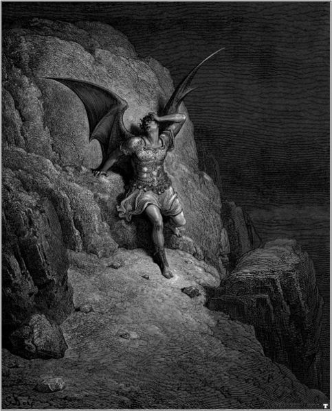

# Lucifer RPG Dev Blog

Hi, my name is Bade! I'm a software developer who likes to make games as a hobby. My current passion project is an RPG about Lucifer and his sword-boyfriend fighting their way out of Hell. I started this blog to help organize my thoughts about the design process and share that with the world. The early entries will be largely abstract, but eventually they'll become updates on the game's progress.

My plan is to update with new content every Wednesday, Friday, and Sunday. Thanks for visiting!

- [**Design Pillars: Inspiration Isn't Enough, Part 1 (7/8/20)**](./entry01-pillarspt1.md)
- [**Design Pillars: From Inspiration To Structure, Part 2 (7/10/20)**](./entry02-pillarspt2.md)
